# Mermaid Diagram Demo - Testing Syntax Rules

This file demonstrates all mermaid diagram types with proper syntax including double-quoted edge labels.

---

## 1. Module Graph (LR)

### Example 1.1: Simple Module Dependencies

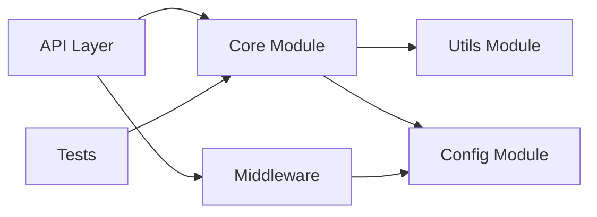

### Example 1.2: Layered Architecture

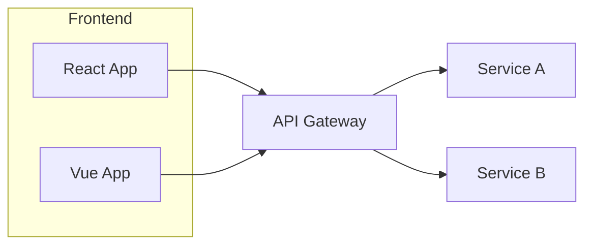

---

## 2. Graph (TD) - Dependency Diagram

### Example 2.1: Application Dependencies

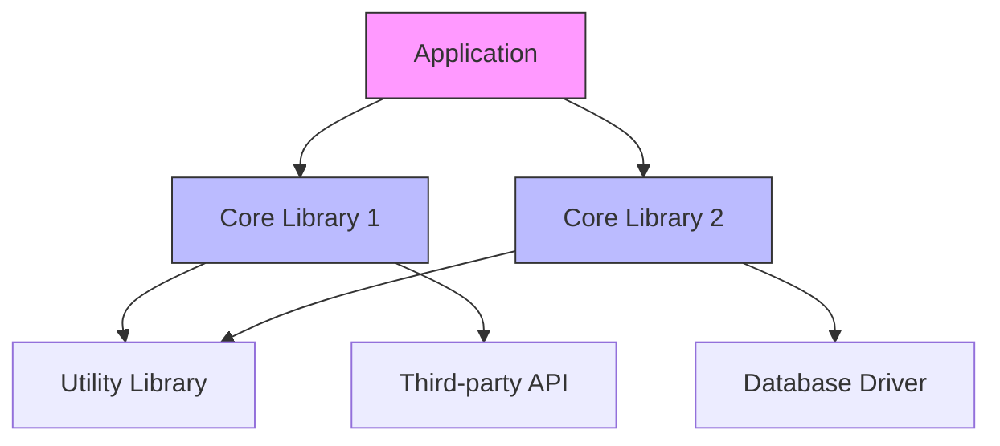

### Example 2.2: Tech Stack Layers

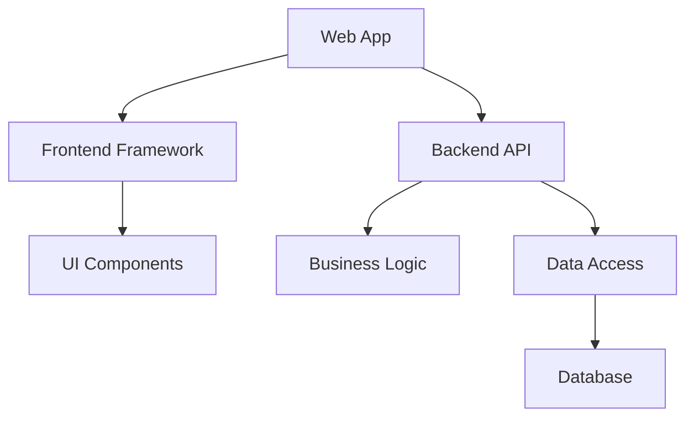

---

## 3. Sequence Diagram

### Example 3.1: User Request Flow

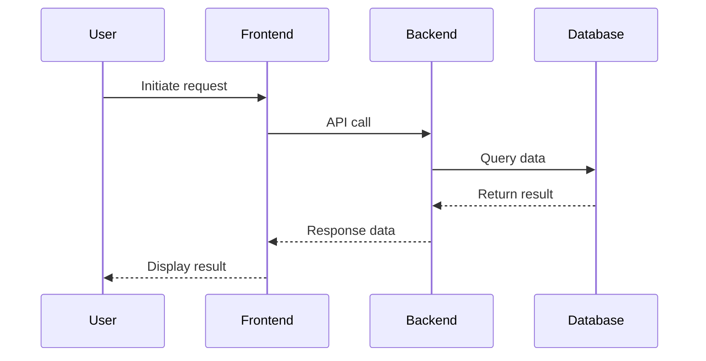

### Example 3.2: Authentication Flow

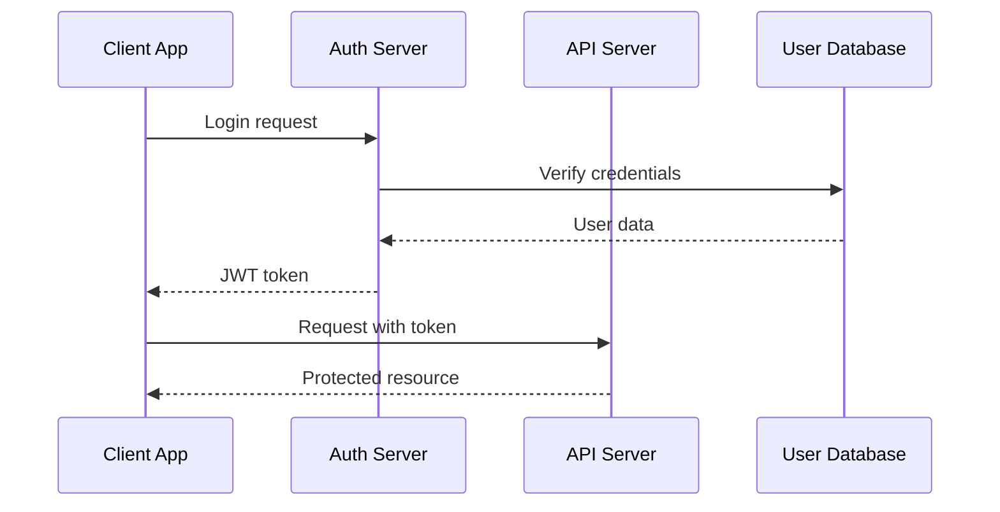

---

## 4. Architecture with Subgraphs

### Example 4.1: Three-Tier Architecture

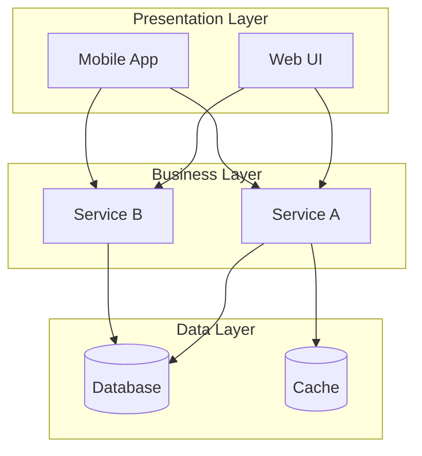

### Example 4.2: Microservices Architecture

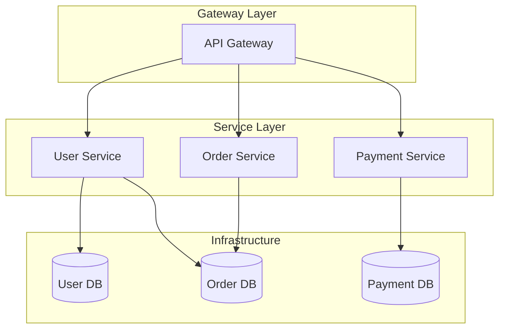

---

## 5. Data Flow Diagram

### Example 5.1: Request Processing Flow

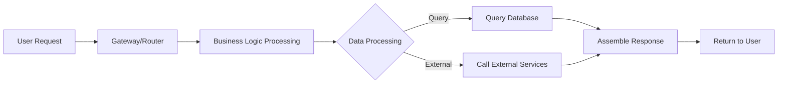

### Example 5.2: ETL Pipeline Flow

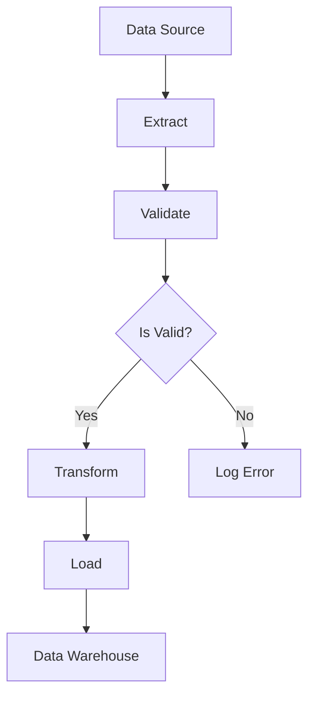

---

## 6. Flowchart with Decision

### Example 6.1: Implementation Process

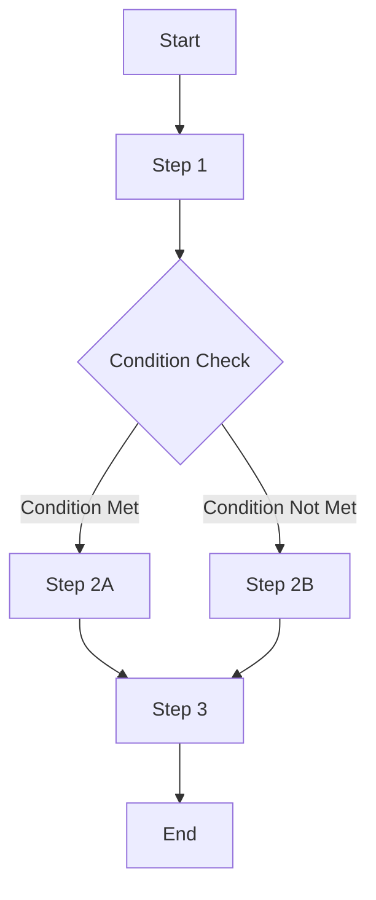

### Example 6.2: Error Handling Flow

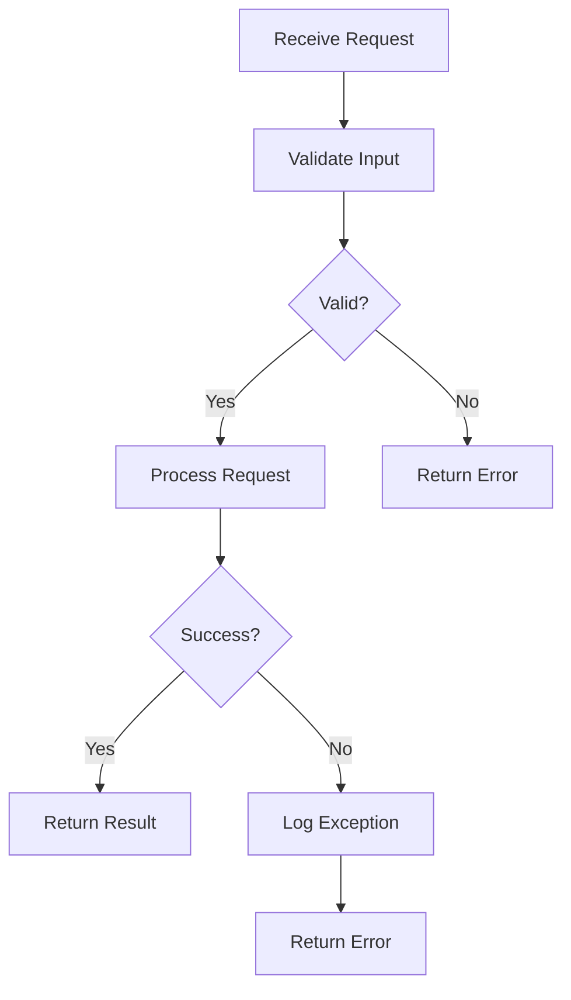

---

## 7. Component Architecture

### Example 7.1: System Components

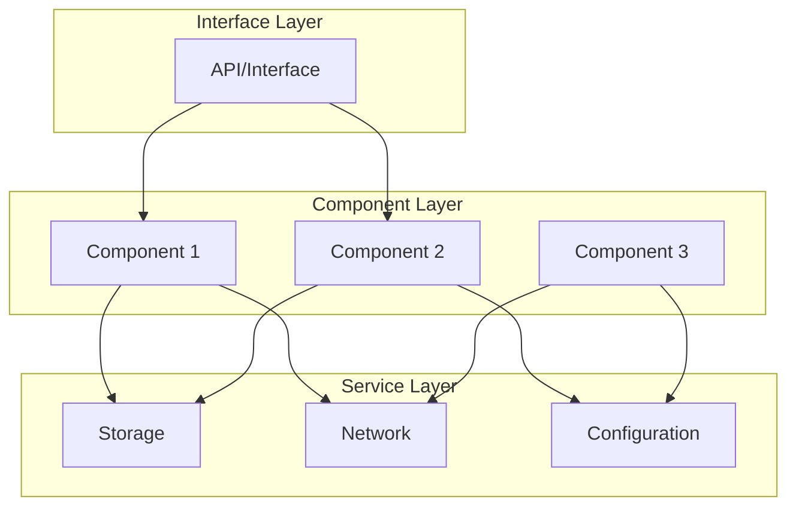

### Example 7.2: Plugin Architecture

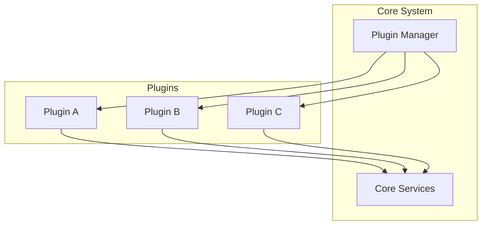

---

## 8. Communication Protocol

### Example 8.1: Client-Server Protocol

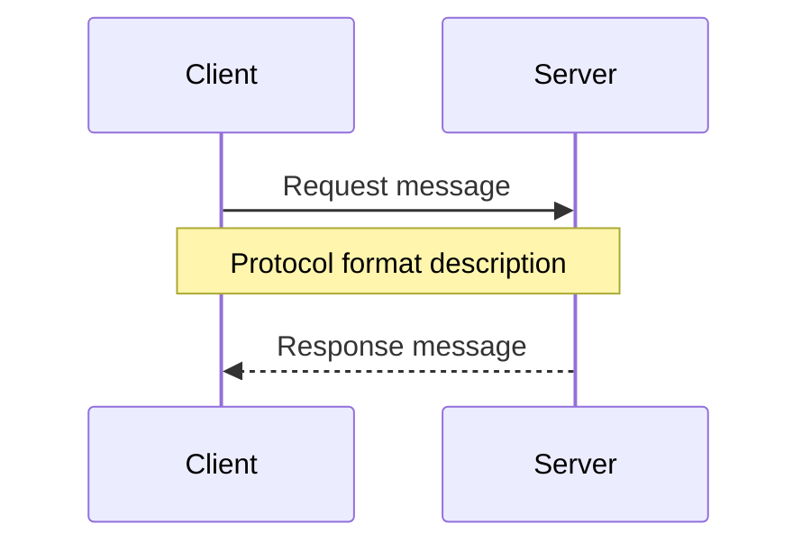

### Example 8.2: Event-Driven Communication

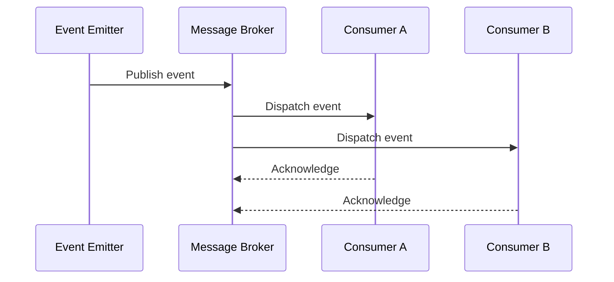

---

## 9. Workflow Tracing

### Example 9.1: End-to-End User Flow

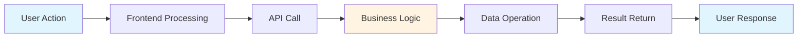

### Example 9.2: Order Processing Flow

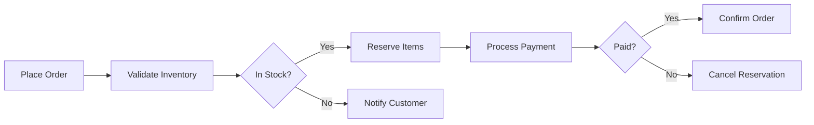

---

## 10. Performance Optimization

### Example 10.1: Optimization Strategies

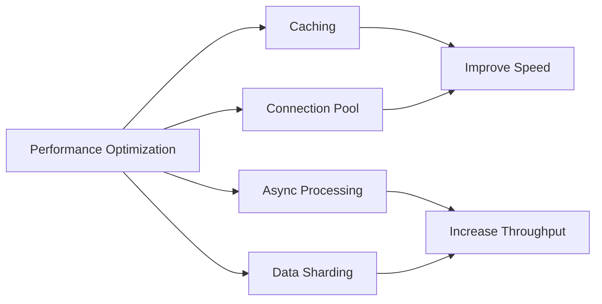

### Example 10.2: Caching Strategy

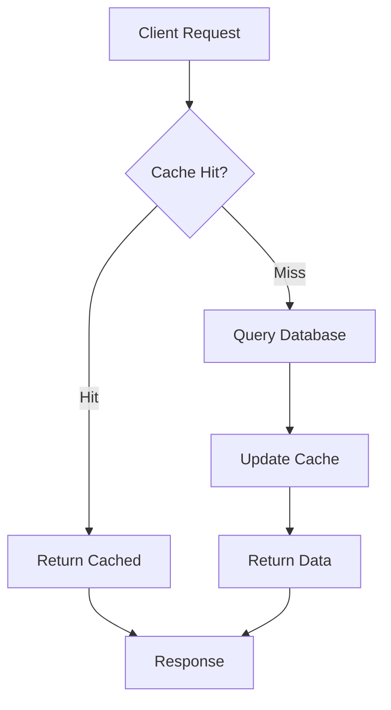

---

## 11. Testing Architecture

### Example 11.1: Test Pyramid

```mermaid
graph TB
    subgraph "Test Levels"
        A["Unit Tests"]
        B["Integration Tests"]
        C["System Tests"]
    end

    subgraph "Test Support"
        D["Mock Tools"]
        E["Test Data"]
        F["Test Environment"]
    end

    A --> D
    B --> D
    B --> E
    C --> F
```

### Example 11.2: CI/CD Pipeline

```mermaid
graph LR
    A["Code Push"] --> B["Build"]
    B --> C["Unit Tests"]
    C --> D{"Passed?"}
    D -->|"Yes"| E["Integration Tests"]
    D -->|"No"| F["Notify Developer"]
    E --> G{"Passed?"}
    G -->|"Yes"| H["Deploy"]
    G -->|"No"| F
```

---

## 12. Deployment Architecture

### Example 12.1: Production Environment

```mermaid
graph TB
    subgraph "Production"
        A["Load Balancer"]
        B["App Instance 1"]
        C["App Instance 2"]
        D[("Database")]
    end

    A --> B
    A --> C
    B --> D
    C --> D
```

### Example 12.2: Multi-Environment Deployment

```mermaid
graph LR
    A["Developer"] --> B["Dev Environment"]
    B --> C["Staging Environment"]
    C --> D["Production Environment"]

    D --> E["CDN"]
    D --> F["Database Cluster"]
```

---

## 13. State Diagram

### Example 13.1: Application States

```mermaid
stateDiagram-v2
    [*] --> Initialization
    Initialization --> Running
    Running --> Paused: User pause
    Running --> Error: Exception
    Paused --> Running: User resume
    Error --> Running: Retry successful
    Error --> [*]: Give up
    Running --> [*]: Completed
```

### Example 13.2: Order States

```mermaid
stateDiagram-v2
    [*] --> Created
    Created --> Paid: Payment received
    Created --> Cancelled: User cancelled
    Paid --> Processing: Start processing
    Processing --> Shipped: Ship order
    Processing --> Refunded: Refund requested
    Shipped --> Delivered: Delivery confirmed
    Delivered --> [*]
    Refunded --> [*]
    Cancelled --> [*]
```

---

## 14. ER Diagram

### Example 14.1: E-Commerce Schema

```mermaid
erDiagram
    USER ||--o{ ORDER : places
    ORDER ||--|{ LINE_ITEM : contains
    PRODUCT ||--o{ LINE_ITEM : "is in"

    USER {
        uuid id PK
        string name
        string email
    }

    ORDER {
        uuid id PK
        uuid user_id FK
        datetime created_at
    }

    PRODUCT {
        uuid id PK
        string name
        decimal price
    }

    LINE_ITEM {
        uuid id PK
        uuid order_id FK
        uuid product_id FK
        int quantity
    }
```

### Example 14.2: Blog Schema

```mermaid
erDiagram
    AUTHOR ||--o{ POST : writes
    POST ||--|{ COMMENT : has
    POST }o--|| CATEGORY : belongs_to

    AUTHOR {
        int id PK
        string name
        string email
    }

    POST {
        int id PK
        string title
        text content
        int author_id FK
        int category_id FK
    }

    COMMENT {
        int id PK
        text body
        int post_id FK
    }

    CATEGORY {
        int id PK
        string name
    }
```

---

## 15. Git Branching (Flowchart Alternative)

> Note: Avoid `gitGraph` — it is fragile. Use flowchart instead.

### Example 15.1: Feature Branch Workflow

```mermaid
graph LR
    A["main"] --> B["develop"]
    B --> C["feature-A"]
    B --> D["feature-B"]
    C --> E["merge to develop"]
    D --> E
    E --> F["merge to main"]
```

### Example 15.2: Git Flow Model

```mermaid
graph LR
    A["main"] --> B["develop"]
    B --> C["feature branch"]
    B --> D["release branch"]
    D --> E["hotfix branch"]
    C --> B
    D --> A
    E --> A
```

---

## Syntax Rules Reference

All diagrams follow these rules:

1. ✅ All node labels use double quotes: `["Label"]`
2. ✅ All edge labels use double quotes: `-->|"label"|`
3. ✅ No spaces in node IDs: `MyNode` not `My Node`
4. ✅ No reserved keywords as IDs: `LoopNode` not `loop`
5. ✅ Matched brackets: `["Label"]` not `{Label]`
6. ✅ Comments use `%%` not `#`
7. ✅ sequenceDiagram uses declared IDs, not aliases
8. ✅ No `style` in sequenceDiagram or stateDiagram
9. ✅ Long chains (8+ nodes) use `TD` not `LR`
10. ✅ Subgraph labels quoted if containing spaces
11. ✅ **Subgraph format is `subgraph ID["Label"]`** — ID outside quotes, label inside quotes

**Subgraph format reference**:
```
subgraph "Label only"        %% label-only format (no ID needed)
    A["Node"]
end

subgraph MyID["Label with ID"]   %% ID + label format
    B["Child Node"]
end

subgraph "WRONG ID["Label"]"     %% NEVER do this — ID inside quotes is wrong
    C["Wrong"]
end
```
